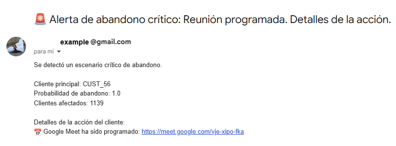
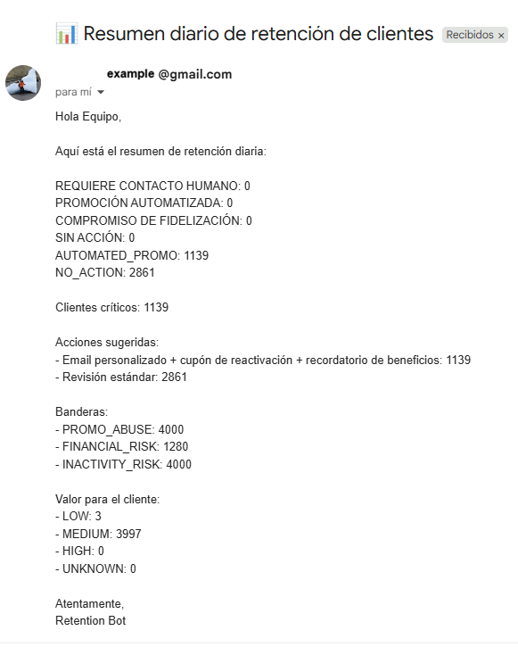
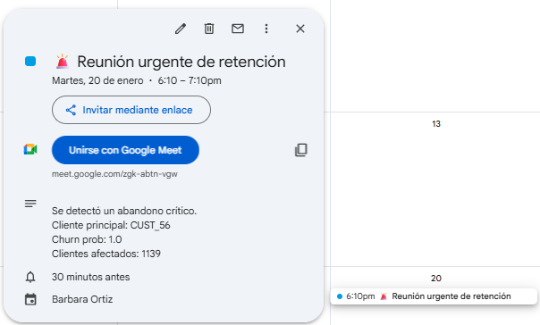
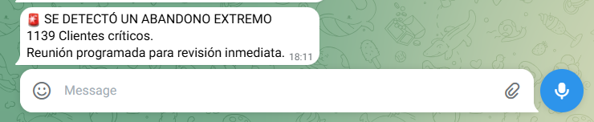
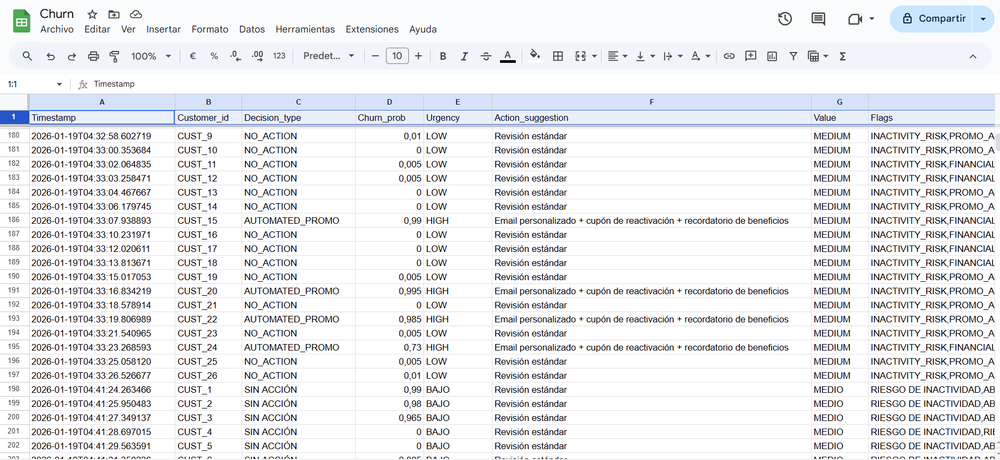

# 🚀 Agentes de retención automáticos

## Sistema Multi-Agente de Respuesta a Churn (integraciones reales, GitHub Actions)

Sistema multi-agente desarrollado en Python para analizar riesgo de churn a gran escala (≈4.000 clientes) y orquestar decisiones de retención alineadas al negocio, combinando:

* Procesamiento batch desde CSV (salidas de modelos ML)
* Resúmenes e insights a nivel manager
* Acciones reales selectivas (Email, Calendar, Telegram)
* Diseño orientado a producción (dry-run, feature flags, schedulers)
* Ejecución totalmente automatizada con GitHub Actions

Este proyecto está pensado primero para managers: en lugar de enviar miles de acciones automáticas a clientes, prioriza la transparencia en la decisión, la agregación de resultados y el realismo operativo.

---

## 🧠 ¿Qué hace este sistema?

Dado un archivo CSV con datos de clientes + probabilidad de churn (generada por el modelo ML calculado en el proyecto), el sistema:

1. Clasifica el riesgo de churn en decisiones de negocio.
2. Genera un resumen ejecutivo para managers (conteos, categorías, ejemplos).
3. Registra resultados en Google Sheets (auditoría y reporting de posibles acciones por cliente).
4. Cuando se genera una reunión por calendar, con un meet,se envía un email notificando.
5. Envía un mensaje por Telegram.
6. Se ejecuta automáticamente mediante GitHub Actions (programado o bajo demanda)

---

## 🏗️ Descripción general de la arquitectura

```bash

                      ┌────────────────────┐
                      │ Datos de Churn CSV │
                      │ (4.000 clientes)   │
                      └─────────┬──────────┘
                                │
                                ▼
                      ┌────────────────────┐
                      │ Carga de Features  │
                      │ Preprocesamiento   │
                      └─────────┬──────────┘
                                │
                                ▼
                      ┌────────────────────┐
                      │ Agente de Decision │
                      │                    │
                      └─────────┬──────────┘
                                │
                                ▼
                      ┌────────────────────┐
                      │ manager summary    │
                      │ (conteos agregados)│
                      └─────────┬──────────┘
                                │
                                ▼
                      ┌────────────────────┐
                      │ Action Agent       │
                      │ (Orquestador)      │
                      └─────────┬──────────┘
                                │
       ┌─────────────┬──────────┼─────────────┐
       ▼             ▼          ▼             ▼
 ┌──────────┐ ┌──────────┐ ┌──────────┐ ┌────────────────────┐
 │ Email    │ │ Calendar │ │ Telegram │ │ Sheets (Auditoría) │
 │ Resumen  │ │  Meet    │ │ Alertas  │ │ por cliente        │
 └──────────┘ └──────────┘ └──────────┘ └────────────────────┘


          
```
**⚡ ⚡ Automatización: main.py se ejecuta completamente vía GitHub Actions, disparando el main.py, el reporte al manager y todos los canales de acción.

```bash
agentes/
│ 
├─ agents/
│  ├─ decision_agent.py               # Reglas de negocio y lógica de decisión
│  ├─ action_agent.py                 # Orquestador de canales
│  ├─ aggregation_agent.py            # Agregaciones y resúmenes
│  ├─ google_agents.py                # Gmail, Calendar, Sheets
│  └─ telegram_agent.py               # Integración Telegram
│
├─ utils/
│  ├─ flags_utils.py                  # Feature flags y switches
│  └─ generate_churn_csv.py           # Generador de CSV de churn
│
├─ data/
│  ├─ customers_with_churn_prob.csv   # Clientes con score de churn
│  └─ rf_v1_baseline_train.csv        # Dataset de entrenamiento
│
├─ models/
│  └─ churn_model.joblib              # Modelo Random Forest
│ 
├─ images/                            # Imágenes y diagramas
│
├─ config/
│  └─ credentials_example.json        # Ejemplo de credenciales
│
├─ scripts/
│  └─ generate_refresh_token.py       # OAuth Google (una sola vez)
│
├─ .env example                       # Ejemplo de variables de entorno secretas
├─ main.py                            # Ejecución batch principal
├─ README.md
└─ requirements.txt

```
---

## 📊 Dataset

* Dataset real de clientes de supermercado
* Variables demográficas y transaccionales
* La probabilidad de churn se calcula con el modelo .joblib
* El sistema no entrena modelos, solo consume sus resultados

---

## 🤖 Lógica de Decisión

Las decisiones son determinísticas y explicables, basadas en la probabilidad de churn:

| Probabilidad de Churn | Decisión               | Significado            |
| --------------------- | ---------------------- | ---------------------- |
| ≥ 0.70                | REQUIRES_HUMAN_CONTACT | Riesgo alto – escalar  |
| 0.50 – 0.69           | AUTOMATED_PROMO        | Retención automatizada |
| 0.30 – 0.49           | LOYALTY_ENGAGEMENT     | Engagement suave       |
| < 0.30                | NO_ACTION              | Sin intervención       |


Esto hace al sistema:

* Predecible
* Auditable
* Amigable para managers
* Apto para producción real

### Matriz de decisión de retención de clientes

| Riesgo de Churn     | Valor  | Flags                     | Acción Sugerida                                                | Urgencia            |
|--------------------|--------|---------------------------|----------------------------------------------------------------|---------------------|
| Alto (>0.7)        | Alto   | INACTIVITY_RISK           | Llamada urgente + beneficio exclusivo + account manager dedicado | CRÍTICA             |
| Alto (>0.6)        | Alto   | FINANCIAL_RISK            | Reunión con account manager + plan personalizado               | CRÍTICA             |
| Alto (>0.6)        | Alto   | PROMO_ABUSE               | Llamada de retención + upgrade a programa premium de lealtad   | ALTA                |
| Alto (>0.6)        | Medio  | INACTIVITY_RISK           | Email personalizado + cupón de reactivación                    | ALTA                |
| Alto (>0.6)        | Medio  | FINANCIAL_RISK            | Email automático + opciones de financiación / cuotas           | ALTA                |
| Alto (>0.6)        | Medio  | PROMO_ABUSE               | Email de programa de puntos + beneficios no monetarios         | MEDIA               |
| Alto (>0.6)        | Bajo   | INACTIVITY_RISK           | Email automático de reactivación + descuento moderado          | MEDIA               |
| Alto (>0.5)        | Bajo   | FINANCIAL_RISK            | Email con productos económicos + programa de referidos        | MEDIA               |
| Alto (>0.6)        | Bajo   | PROMO_ABUSE               | Email educativo de productos + descuento único                 | MEDIA               |
| Bajo (<0.3)        | Alto   | Ninguno                   | Programa VIP automático + acceso anticipado + eventos          | BAJA                |
| Medio (0.3–0.5)    | Alto   | Cualquiera                | Contacto proactivo + sorpresa + solicitud de feedback          | BAJA                |
| Casos Especiales   | Custom | PROMO_ABUSE / FINANCIAL_RISK / otros | Acciones personalizadas según el perfil del cliente | BAJA–MEDIA–ALTA     |


🔴 CRÍTICO

🟠 ALTO

🟡 MEDIO

🟢 BAJO

---

## 👥 Acciones para Managers

- Distribución agregada de abandono
- Recuentos por categoría de decisión
- Clientes de ejemplo por categoría
- Fila de Hoja de Cálculo de Google
- Resumen de correo electrónico único
- Sincronización del calendario (reuniones de revisión)
- Bot de Telegram informando en el caso de muchos clientes con alta probabilidad de abandono
- Ejecución progarmada automatizada mediante GitHub Actions (`main.py` se ejecuta según lo programado)

---

## ⚙️ Agente de acción (Orquestador central)

Todas las ejecuciones se realizan mediante:

```python
action_agent(decision)
```

Responsabilidades:

- Selección de canal (correo electrónico/calendario/Telegram/auditoría)
- Indicadores de características 
- Gestión y actualización de OAuth
- Registro de auditoría
- Admite activadores programados: ejecuciones locales por lotes o flujo de trabajo de GitHub Actions

### Ejemplo de flujo de alto riesgo

Para `REQUIRES_HUMAN_CONTACT`:

- 📧 Notificación por correo electrónico
- 📅 Reunión de calendario (+ enlace de Meet)
- 📊 Auditoría de Hojas de Cálculo de Google

---
## 📌 Canales de Acción

El Agente de Acción ejecuta cada acción del cliente a través de un único orquestador (`action_agent()`), activando el canal adecuado según el riesgo de abandono:

**Correo Electrónico**
Envía correos electrónicos personalizados o resumidos a los gerentes.




**Calendario**
Programa reuniones y genera enlaces de Google Meet para clientes de alto riesgo.



**Telegrama**
Envía alertas críticas o mensajes de interacción a través del bot de Telegram.



**Hoja de Auditoría**
Registra acciones y resúmenes de gerentes en Hojas de Cálculo de Google para auditorías e informes. 

---

## 🧪 Estrategia de Pruebas

✅ Pruebas Basadas en Acciones

* Solo correo electrónico
* Correo electrónico + Reunión + Calendario
* Registros de auditoría de Hojas de cálculo
* Mensaje de Telegram
* Sin acción

✅ Pruebas de Ejecución por Lotes

Validar el comportamiento de los lotes con entradas CSV:

- Múltiples clientes (escala 4k)
- Decisiones deterministas basadas en la pérdida de clientes (no aleatorias)
- Integraciones reales habilitadas (correo electrónico, hojas de cálculo, calendario)
- Ejecución automatizada de GitHub Actions probada con éxito

✅ Programador

- Ejecución manual
- Preparado para GitHub Actions

---

## 🧱 Tech Stack

- Python 3.12
- Pandas
- Google APIs (Gmail, Calendar, Sheets, Meet)
- Telegram Bot API
- OAuth 2.0
- python-dotenv
- GitHub Actions (batch automation)

---
## 🚧 Próximos pasos

- 🧠 Reemplazar reglas con la capa de explicabilidad de ML
- ☁️ Implementación en la nube (GCP / AWS / Azure)
- 📊 Panel del administrador (BI / Looker / Streamlit)

---

## 🎯 ¿Por qué este proyecto?

Este es **un proyecto empresarial real**. Demuestra:

- Orquestación multiagente
- Diseño orientado a lotes y orientado al administrador
- Integraciones de API reales
- Restricciones de producción (escala, costo, seguridad)
- Separación clara entre decisión y ejecución
- Automatización mediante acciones de Github

Refleja **cómo funcionan realmente los sistemas de retención en las empresas**.
---

## ▶️ Cómo usar

### 1. Instalar dependencias

```bash
pip install -r requirements.txt
```

### 2. Variables de entorno

Crea un archivo .env:

```bash

# APIs de Google
GOOGLE_CREDENTIALS_FILE=config/google_credentials.json
GMAIL_CLIENT_ID=tu_id_de_cliente
GMAIL_CLIENT_SECRET=tu_secreto_de_cliente
GMAIL_REFRESH_TOKEN=tu_token_de_actualización

# Gmail
GMAIL_SENDER=tu_correo_electrónico@gmail.com
GMAIL_RECIPIENT=tu_correo_electrónico@gmail.com

# Hojas de Cálculo de Google
SPREADSHEET_ID=tu_id_de_hoja

# Telegram
TELEGRAM_BOT_TOKEN=tu_token_de_bot
TELEGRAM_CHAT_ID=tu_id_de_chat

# Otros
DRY_RUN=true

```

#### 🚨Notas para GitHub Actions

Al crear un desencadenador de flujo de trabajo de GitHub Actions (p. ej., push, programación), es más seguro almacenar los secretos como variables de entorno de GitHub Actions en lugar de confirmar el archivo .env.

1. Ir a tu repositorio -> Configuración -> Secretos y variables -> Acciones -> Nuevo secreto de repositorio.
2. Agrega cada secreto (p. ej., GMAIL_CLIENT_ID, TELEGRAM_BOT_TOKEN, etc.).
3. En el YAML de tu flujo de trabajo, haz referencia a ellos de la siguiente manera:

```bash
env:
GMAIL_CLIENT_ID: ${{ secrets.GMAIL_CLIENT_ID }}
GMAIL_CLIENT_SECRET: ${{ secrets.GMAIL_CLIENT_SECRET }}
GMAIL_REFRESH_TOKEN: ${{ secrets.GMAIL_REFRESH_TOKEN}}
GMAIL_RECIPIENT: ${{ secrets.GMAIL_RECIPIENT}}
SPREADSHEET_ID: ${{ secrets.SPREADSHEET_ID }}

TELEGRAM_BOT_TOKEN: ${{ secrets.TELEGRAM_BOT_TOKEN }}
TELEGRAM_CHAT_ID: ${{ secrets.TELEGRAM_CHAT_ID }}
```

De esta forma, las credenciales confidenciales nunca se comprometen con GitHub y se inyectan de forma segura cuando se ejecuta el flujo de trabajo.

### 3. Simular ejecución diaria

```bash
python main.py
```

Compatibilidad con:

- `dry_run=True`
- Acciones limitadas del cliente
- Informes completos del administrador


### 🔒 Notas

* Los tokens de Google OAuth pueden caducar (se gestiona mediante la lógica de actualización).
* Los fallos se registran y no bloquean el flujo de trabajo.
* Todas las acciones se ejecutan a través de un único punto de entrada.

---

## Autora

**Bárbara Ángeles Ortiz**


[LinkedIn](https://www.linkedin.com/in/barbaraangelesortiz/)  

 📅 Enero 2026


